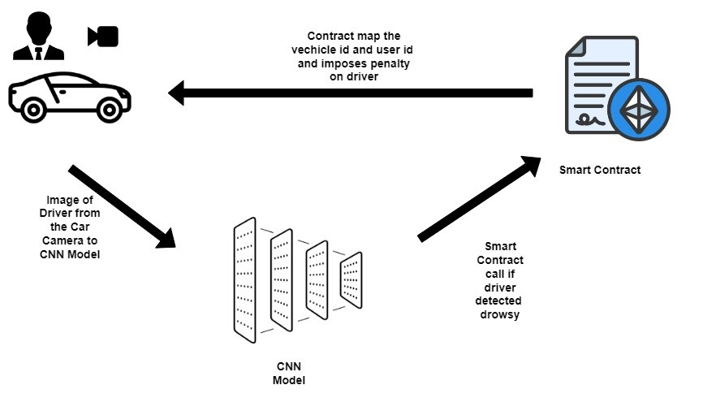

# Drowsiness-Detection-for-Intelligent-Transportation-Systems
Implemented Federated learning to train CNN models on the local dataset to ensure data privacy. Integrated detection outputs into a blockchain-based smart contract for secure data storage and penalties enforcement. The global model’s accuracy stabilizes around 97.45% by using Adam as an optimizer with a learning rate of 0.001.

## Introduction 
Fatigue and drowsiness significantly compromise road safety, leading to severe injuries, fatalities, and increased costs. Despite regulations limiting professional drivers' working hours, drowsiness remains a prevalent issue, exacerbated by modern stressors like road rage. Traditional transportation infrastructure struggles to address these increasing road hazards, highlighting the need for Intelligent Transportation Systems (ITS) that incorporate automatic fatigue detection.

Deep learning (DL) methods have been explored for driver drowsiness detection, but challenges such as the need for large datasets, data distribution, and privacy concerns limit their effectiveness. Federated learning (FL) emerges as a promising alternative by facilitating collaborative model training across edge nodes (e.g., vehicles, OEMs) without transmitting raw data, thus protecting driver privacy. FL is particularly well-suited for networks like IoT models and applications in mobile devices and self-driving cars. 

## Proposed Architecture
 - ### Mathematical Formulation
The system model comprises multiple clients, denoted as 𝑛1, 𝑛2, 𝑛3, . . . , 𝑛𝑚 ∈ 𝑁, where 𝑚 signifies the total number of clients. Each client possesses its own local dataset of driver’s drowsiness, 𝑑𝑑1, 𝑑𝑑2, 𝑑𝑑3, . . . , 𝑑𝑑𝑚 ∈ 𝐷𝐷, utilized
for training the drowsiness detection model. Notably, each client, represented by 𝑛𝑙 ∈ 𝑁, is furnished with a camera 𝑐𝑎𝑚1, 𝑐𝑎𝑚2, 𝑐𝑎𝑚3, . . . , 𝑐𝑎𝑚𝑘 ∈ 𝐶 𝐴𝑀 that continuously captures 𝑘 image frames.

𝑛𝑙(camera) −−−−→ CAM

For executing federated training, there exist clients 𝑛1, 𝑛2, 𝑛3, . . . , 𝑛𝑚 ∈ 𝑁, each possessing its own dataset 𝑑𝑑1, 𝑑𝑑2, 𝑑𝑑3, . . . , 𝑑𝑑𝑚 ∈ 𝐷𝐷. For training purposes, each client 𝑛𝑙 ∈ 𝑁 employs its local data to train the CNN model
(Θ) for 𝑝 epochs.

𝑛𝑙(node) −−−−→ 𝑑𝑑𝑙(local data) −−−−→ Θ

Once the model is trained at each client’s end, each client proceeds to transmit the acquired trained weights (𝜔) to a centralized federation server (𝐹𝑆).

𝜔𝑙(local weight) −−−−−→ 𝐹𝑆 (3)

At the federated server, a federation algorithm (𝜙) is applied to aggregate the weights, resulting in global weights (𝛾). These global weights are then transmitted back to each client, and this iterative process continues for a specified number of rounds, denoted as 𝑅.

𝐹𝑆(weight in Server) --−→ (𝛾)

After training the CNN model, blockchain technology is incorporated into the proposed architecture. A Smart Contract (𝑆𝐶) is deployed on the blockchain. Each vehicle (𝑉) is associated with a camera with a unique ID, and the driver’s image (𝑑𝑖) from the camera is fed to the CNN model to classify whether the driver is drowsy or not.

𝑑𝑖𝑙 (Driver Image from Camera (V)) −−−→ 𝜁 

If the CNN model classifies the image as drowsy, the smart contract is invoked. The smart contract retrieves the driver’s license and applies an appropriate penalty to the driver.

𝑆𝐶(Smart Contract) −−−→ 𝑑𝑖𝑙 

Based on the issues described above, we have developed an objective function, denoted as (𝑜𝑏 𝑗), which aims to recognize drowsy behaviour and maximize the accuracy of the CNN architecture (utilized in federated learning) to efficiently
perform drowsy behaviour classification

𝑜𝑏𝑗 = max 𝑎𝑐𝑐𝑢𝑟𝑎𝑐𝑦 ∑︁ (𝑋)

Here, 𝑋 represents the combined distributed CNN architecture employed for drowsy behaviour detection. In order
to effectively identify drowsy behaviour, the suggested work
seeks to maximize CNN architecture accuracy.

 The overall architecture is shown in the figure below 
  

## Installation 
  - Clone Repo
      - git clone <repository_url>
      - cd Drowsiness-Detection-for-Intelligent-Transportation-Systems
  - Python
  - Tensorflow
  - Pandas
  - Numpy
  - Matplotlib
  - Sklearn

